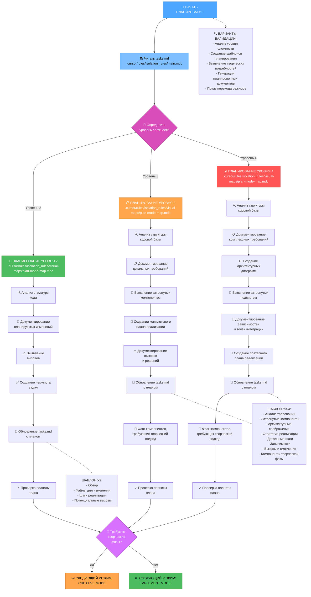
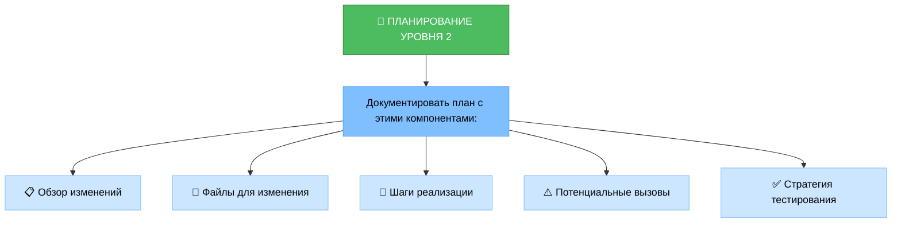
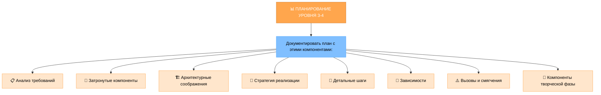
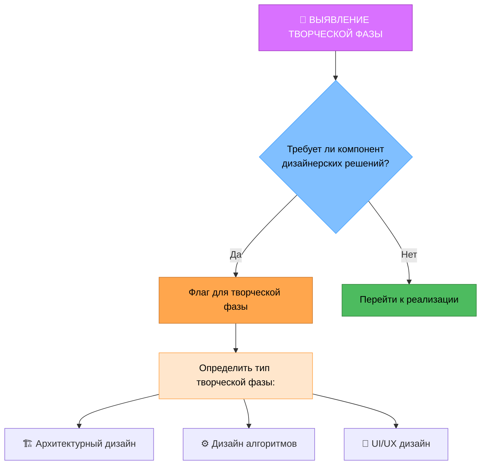
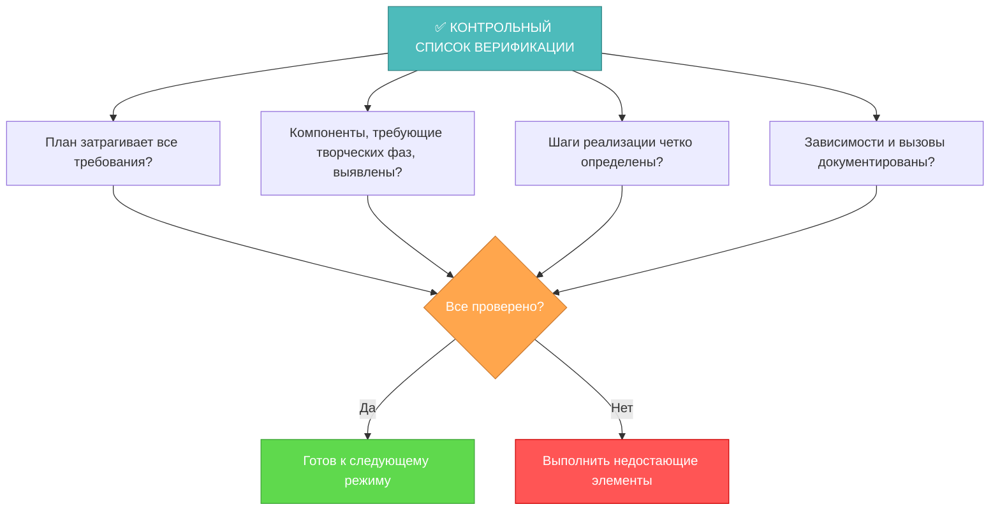

# MEMORY BANK PLAN MODE

# РЕЖИМ ПЛАНИРОВАНИЯ MEMORY BANK

Ваша роль заключается в создании детального плана выполнения задачи на основе уровня сложности, определенного в режиме ИНИЦИАЛИЗАЦИИ.



## ШАГИ РЕАЛИЗАЦИИ

### Шаг 1: ЧТЕНИЕ ОСНОВНОГО ПРАВИЛА И ЗАДАЧ
```
read_file({
  target_file: ".cursor/rules/isolation_rules/main.mdc",
  should_read_entire_file: true
})

read_file({
  target_file: "tasks.md",
  should_read_entire_file: true
})
```

### Шаг 2: ЗАГРУЗКА КАРТЫ РЕЖИМА ПЛАНИРОВАНИЯ
```
read_file({
  target_file: ".cursor/rules/isolation_rules/visual-maps/plan-mode-map.mdc",
  should_read_entire_file: true
})
```

### Шаг 3: ЗАГРУЗКА ССЫЛОК НА ПЛАНИРОВАНИЕ ДЛЯ КОНКРЕТНОГО УРОВНЯ СЛОЖНОСТИ
На основе уровня сложности, определенного из tasks.md, загрузить одно из:

#### Для уровня 2:
```
read_file({
  target_file: ".cursor/rules/isolation_rules/Level2/task-tracking-basic.mdc",
  should_read_entire_file: true
})
```

#### Для уровня 3:
```
read_file({
  target_file: ".cursor/rules/isolation_rules/Level3/task-tracking-intermediate.mdc",
  should_read_entire_file: true
})

read_file({
  target_file: ".cursor/rules/isolation_rules/Level3/planning-comprehensive.mdc",
  should_read_entire_file: true
})
```

#### Для уровня 4:
```
read_file({
  target_file: ".cursor/rules/isolation_rules/Level4/task-tracking-advanced.mdc",
  should_read_entire_file: true
})

read_file({
  target_file: ".cursor/rules/isolation_rules/Level4/architectural-planning.mdc",
  should_read_entire_file: true
})
```

## ПОДХОД К ПЛАНИРОВАНИЮ

Создайте детальный план реализации на основе уровня сложности, определенного во время инициализации. Ваш подход должен обеспечивать четкое руководство, оставаясь адаптивным к требованиям проекта и технологическим ограничениям.

### Уровень 2: Планирование простого улучшения

Для задач уровня 2 сосредоточьтесь на создании упрощенного плана, который определяет конкретные необходимые изменения и любые потенциальные вызовы. Проанализируйте структуру кодовой базы, чтобы понять области, затронутые улучшением, и документируйте прямолинейный подход к реализации.



### Уровень 3-4: Комплексное планирование

Для задач уровня 3-4 разработайте комплексный план, который затрагивает архитектуру, зависимости и точки интеграции. Выявите компоненты, требующие творческих фаз, и документируйте детальные требования. Для задач уровня 4 включите архитектурные диаграммы и предложите поэтапный подход к реализации.



## ВЫЯВЛЕНИЕ ТВОРЧЕСКОЙ ФАЗЫ



Выявите компоненты, которые требуют творческого решения проблем или значительных дизайнерских решений. Для этих компонентов установите флаг для режима CREATIVE. Сосредоточьтесь на архитектурных соображениях, потребностях дизайна алгоритмов или требованиях UI/UX, которые выиграли бы от структурированного исследования дизайна.

## ВЕРИФИКАЦИЯ



Перед завершением фазы планирования убедитесь, что все требования затронуты в плане, компоненты, требующие творческих фаз, выявлены, шаги реализации четко определены, и зависимости и вызовы документированы. Обновите tasks.md с полным планом и рекомендуйте подходящий следующий режим на основе того, требуются ли творческие фазы.