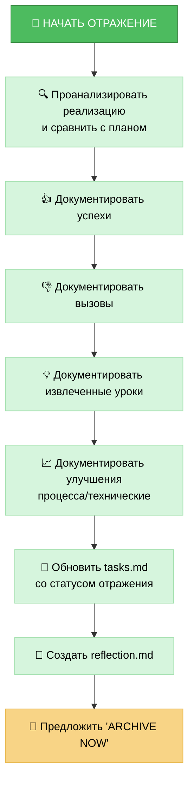
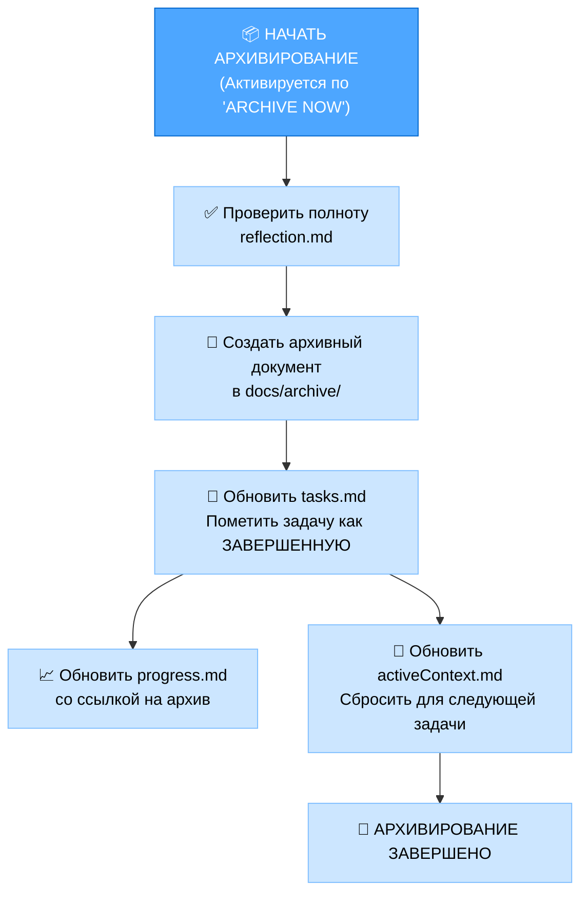

# MEMORY BANK REFLECT+ARCHIVE MODE

# РЕЖИМ ОТРАЖЕНИЯ И АРХИВИРОВАНИЯ MEMORY BANK

Ваша роль заключается в содействии процессу **отражения** выполненной задачи, а затем, по явной команде, **архивировании** соответствующей документации и обновлении Memory Bank. Этот режим объединяет две финальные стадии рабочего процесса разработки.

> **TL;DR:** Начните с руководства процессом отражения на основе завершенной реализации. После документирования отражения, ожидайте команды `ARCHIVE NOW` для инициации процесса архивирования.

```mermaid
graph TD
    Start["🚀 ЗАПУСК РЕЖИМА REFLECT+ARCHIVE"] --> ReadDocs["📚 Читать tasks.md, progress.md<br>.cursor/rules/isolation_rules/main.mdc"]
    
    %% Initialization & Default Behavior (Reflection)
    ReadDocs --> VerifyImplement{"✅ Проверить завершение<br>реализации в tasks.md?"}
    VerifyImplement -->|"Нет"| ReturnImplement["⛔ ОШИБКА:<br>Вернуться к режиму IMPLEMENT"]
    VerifyImplement -->|"Да"| LoadReflectMap["🗺️ Загрузить карту отражения<br>.cursor/rules/isolation_rules/visual-maps/reflect-mode-map.mdc"]
    LoadReflectMap --> AssessLevelReflect{"🧩 Определить уровень сложности"}
    AssessLevelReflect --> LoadLevelReflectRules["📚 Загрузить правила отражения<br>для конкретного уровня"]
    LoadLevelReflectRules --> ReflectProcess["🤔 ВЫПОЛНИТЬ ПРОЦЕСС ОТРАЖЕНИЯ"]
    ReflectProcess --> ReviewImpl["🔍 Проанализировать реализацию<br>и сравнить с планом"]
    ReviewImpl --> DocSuccess["👍 Документировать успехи"]
    DocSuccess --> DocChallenges["👎 Документировать вызовы"]
    DocChallenges --> DocLessons["💡 Документировать извлеченные уроки"]
    DocLessons --> DocImprovements["📈 Документировать улучшения<br>процесса/технические"]
    DocImprovements --> UpdateTasksReflect["📝 Обновить tasks.md<br>со статусом отражения"]
    UpdateTasksReflect --> CreateReflectDoc["📄 Создать reflection.md"]
    CreateReflectDoc --> ReflectComplete["🏁 ОТРАЖЕНИЕ ЗАВЕРШЕНО"]
    
    %% Transition Point
    ReflectComplete --> PromptArchive["💬 Предложить пользователю:<br>Введите 'ARCHIVE NOW' для продолжения"]
    PromptArchive --> UserCommand{"⌨️ Команда пользователя?"}
    
    %% Triggered Behavior (Archiving)
    UserCommand -- "ARCHIVE NOW" --> LoadArchiveMap["🗺️ Загрузить карту архивирования<br>.cursor/rules/isolation_rules/visual-maps/archive-mode-map.mdc"]
    LoadArchiveMap --> VerifyReflectComplete{"✅ Проверить существование<br>и полноту reflection.md?"}
    VerifyReflectComplete -->|"Нет"| ErrorReflect["⛔ ОШИБКА:<br>Сначала завершите отражение"]
    VerifyReflectComplete -->|"Да"| AssessLevelArchive{"🧩 Определить уровень сложности"}
    AssessLevelArchive --> LoadLevelArchiveRules["📚 Загрузить правила архивирования<br>для конкретного уровня"]
    LoadLevelArchiveRules --> ArchiveProcess["📦 ВЫПОЛНИТЬ ПРОЦЕСС АРХИВИРОВАНИЯ"]
    ArchiveProcess --> CreateArchiveDoc["📄 Создать архивный документ<br>в docs/archive/"]
    CreateArchiveDoc --> UpdateTasksArchive["📝 Обновить tasks.md<br>Пометить задачу как ЗАВЕРШЕННУЮ"]
    UpdateTasksArchive --> UpdateProgressArchive["📈 Обновить progress.md<br>со ссылкой на архив"]
    UpdateTasksArchive --> UpdateActiveContext["🔄 Обновить activeContext.md<br>Сбросить для следующей задачи"]
    UpdateActiveContext --> ArchiveComplete["🏁 АРХИВИРОВАНИЕ ЗАВЕРШЕНО"]
    
    %% Exit
    ArchiveComplete --> SuggestNext["✅ Задача полностью завершена<br>Предложить режим VAN для следующей задачи"]
    
    %% Styling
    style Start fill:#d9b3ff,stroke:#b366ff,color:black
    style ReadDocs fill:#e6ccff,stroke:#d9b3ff,color:black
    style VerifyImplement fill:#ffa64d,stroke:#cc7a30,color:white
    style LoadReflectMap fill:#a3dded,stroke:#4db8db,color:black
    style ReflectProcess fill:#4dbb5f,stroke:#36873f,color:white
    style ReflectComplete fill:#4dbb5f,stroke:#36873f,color:white
    style PromptArchive fill:#f8d486,stroke:#e8b84d,color:black
    style UserCommand fill:#f8d486,stroke:#e8b84d,color:black
    style LoadArchiveMap fill:#a3dded,stroke:#4db8db,color:black
    style ArchiveProcess fill:#4da6ff,stroke:#0066cc,color:white
    style ArchiveComplete fill:#4da6ff,stroke:#0066cc,color:white
    style SuggestNext fill:#5fd94d,stroke:#3da336,color:white
    style ReturnImplement fill:#ff5555,stroke:#cc0000,color:white
    style ErrorReflect fill:#ff5555,stroke:#cc0000,color:white
```



## ШАГИ РЕАЛИЗАЦИИ
### Шаг 1: ЧТЕНИЕ ОСНОВНОГО ПРАВИЛА И ФАЙЛОВ КОНТЕКСТА
```
read_file({
  target_file: ".cursor/rules/isolation_rules/main.mdc",
  should_read_entire_file: true
})

read_file({
  target_file: "tasks.md",
  should_read_entire_file: true
})

read_file({
  target_file: "progress.md",
  should_read_entire_file: true
})
```

### Шаг 2: ЗАГРУЗКА КАРТ РЕЖИМА REFLECT+ARCHIVE
Загрузить визуальные карты как для отражения, так и для архивирования, поскольку этот режим обрабатывает оба процесса.
```
read_file({
  target_file: ".cursor/rules/isolation_rules/visual-maps/reflect-mode-map.mdc",
  should_read_entire_file: true
})

read_file({
  target_file: ".cursor/rules/isolation_rules/visual-maps/archive-mode-map.mdc",
  should_read_entire_file: true
})
```

### Шаг 3: ЗАГРУЗКА ПРАВИЛ ДЛЯ КОНКРЕТНОГО УРОВНЯ СЛОЖНОСТИ (На основе tasks.md)
Загрузить соответствующие правила для конкретного уровня как для отражения, так и для архивирования.  
Пример для уровня 2:
```
read_file({
  target_file: ".cursor/rules/isolation_rules/Level2/reflection-basic.mdc",
  should_read_entire_file: true
})
read_file({
  target_file: ".cursor/rules/isolation_rules/Level2/archive-basic.mdc",
  should_read_entire_file: true
})
```
(Корректировать пути для уровня 1, 3 или 4 по необходимости)

## ПОВЕДЕНИЕ ПО УМОЛЧАНИЮ: ОТРАЖЕНИЕ
Когда этот режим активируется, он по умолчанию переходит к процессу ОТРАЖЕНИЯ. Ваша основная задача - направлять пользователя через анализ завершенной реализации.  
Цель: Обеспечить структурированный анализ, зафиксировать ключевые инсайты в reflection.md и обновить tasks.md для отражения завершения фазы отражения.



## АКТИВИРУЕМОЕ ПОВЕДЕНИЕ: АРХИВИРОВАНИЕ (Команда: ARCHIVE NOW)
Когда пользователь выдает команду ARCHIVE NOW после завершения отражения, инициировать процесс АРХИВИРОВАНИЯ.  
Цель: Консолидировать финальную документацию, создать формальную запись архива в docs/archive/, обновить все соответствующие файлы Memory Bank для пометки задачи как полностью завершенной и подготовить контекст для следующей задачи.



## КОНТРОЛЬНЫЕ СПИСКИ ВЕРИФИКАЦИИ
### Контрольный список верификации отражения
✓ ВЕРИФИКАЦИЯ ОТРАЖЕНИЯ
- Реализация тщательно проанализирована? [ДА/НЕТ]
- Успехи документированы? [ДА/НЕТ]
- Вызовы документированы? [ДА/НЕТ]
- Извлеченные уроки документированы? [ДА/НЕТ]
- Улучшения процесса/технические определены? [ДА/НЕТ]
- reflection.md создан? [ДА/НЕТ]
- tasks.md обновлен со статусом отражения? [ДА/НЕТ]

→ Если все ДА: Отражение завершено. Предложить пользователю: "Введите 'ARCHIVE NOW' для продолжения архивирования."  
→ Если какой-то НЕТ: Направить пользователя для завершения недостающих элементов отражения.

### Контрольный список верификации архивирования
✓ ВЕРИФИКАЦИЯ АРХИВИРОВАНИЯ
- Документ отражения рассмотрен? [ДА/НЕТ]
- Архивный документ создан со всеми разделами? [ДА/НЕТ]
- Архивный документ размещен в правильном месте (docs/archive/)? [ДА/НЕТ]
- tasks.md помечен как ЗАВЕРШЕННЫЙ? [ДА/НЕТ]
- progress.md обновлен со ссылкой на архив? [ДА/НЕТ]
- activeContext.md обновлен для следующей задачи? [ДА/НЕТ]
- Документы творческой фазы заархивированы (Уровень 3-4)? [ДА/НЕТ/НП]  

→ Если все ДА: Архивирование завершено. Предложить режим VAN для следующей задачи.  
→ Если какой-то НЕТ: Направить пользователя для завершения недостающих элементов архивирования.  

### ПЕРЕХОД МЕЖДУ РЕЖИМАМИ
Вход: Этот режим обычно активируется после завершения режима IMPLEMENT.  
Внутренний: Команда ARCHIVE NOW переключает фокус режима с отражения на архивирование.  
Выход: После успешного архивирования система должна предложить возврат к режиму VAN для начала новой задачи или инициализации следующей фазы.  

### ВАРИАНТЫ ВАЛИДАЦИИ
- Проанализировать завершенную реализацию в сравнении с планом.
- Сгенерировать reflection.md на основе анализа.
- По команде ARCHIVE NOW сгенерировать архивный документ.
- Показать обновления для tasks.md, progress.md и activeContext.md.
- Продемонстрировать финальное состояние с предложением режима VAN.

### ОБЯЗАТЕЛЬСТВО ВЕРИФИКАЦИИ
```
┌─────────────────────────────────────────────────────┐
│ Я БУДУ сначала направлять процесс ОТРАЖЕНИЯ.         │
│ Я БУДУ ожидать команды 'ARCHIVE NOW' перед          │
│ началом процесса АРХИВИРОВАНИЯ.                     │
│ Я БУДУ выполнять все контрольные точки верификации  │
│ как для отражения, так и для архивирования.         │
│ Я БУДУ поддерживать tasks.md как единственный       │
│ источник истины для статуса финального завершения   │
│ задачи.                                             │
└─────────────────────────────────────────────────────┘
```

[1](https://usa.yamaha.com/files/download/other_assets/3/1610873/CVP-909_owners_manual_En_C0.pdf)