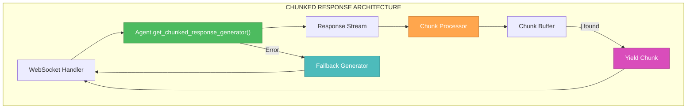
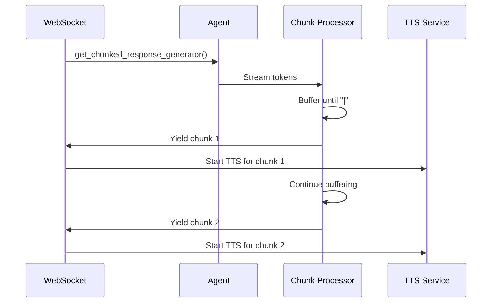

# 🎨 CREATIVE PHASE: CHUNKED RESPONSE GENERATOR ARCHITECTURE

**Дата:** 2025-01-27  
**Тип:** Architecture Design  
**Статус:** ✅ ЗАВЕРШЕНО

---

## 🎯 ПРОБЛЕМА

Текущая система генерирует полный ответ AI перед началом TTS, что создает задержку 2.74 секунды. Нужна архитектура для streaming chunking по символу "|" для немедленного TTS первого предложения.

## 📋 ТРЕБОВАНИЯ И ОГРАНИЧЕНИЯ

### Функциональные требования:
- Генерация ответов по чанкам с разделителем "|"
- Первый чанк готов через 0.6-0.8с от начала AI генерации
- Сохранение качества ответов
- Fallback на полную генерацию при ошибках

### Технические ограничения:
- Совместимость с существующим Agent классом
- Интеграция с WebSocket для передачи чанков
- Обработка edge cases (отсутствие "|", ошибки генерации)
- Минимальные изменения в существующем коде

### Производительные требования:
- Время первого чанка: <0.8с
- Пропускная способность: без деградации
- Надежность: 99%+ успешных chunking операций

---

## 🔍 АНАЛИЗ ВАРИАНТОВ

### ВАРИАНТ 1: МОДИФИКАЦИЯ СУЩЕСТВУЮЩЕГО get_response_generator

**Описание:** Добавить chunking логику в существующий метод генерации

**Плюсы:**
- Минимальные изменения в существующем коде
- Переиспользование существующей логики генерации
- Простая интеграция с WebSocket
- Низкая сложность реализации

**Минусы:**
- Зависимость от существующего промпта
- Ограниченная гибкость в обработке chunking
- Сложность отладки chunking логики

**Техническая совместимость:** Высокая  
**Сложность:** Низкая  
**Время реализации:** 2-3 часа

### ВАРИАНТ 2: ОТДЕЛЬНЫЙ CHUNKED GENERATOR СЕРВИС

**Описание:** Создать независимый сервис для chunked генерации

**Плюсы:**
- Полная независимость от существующего кода
- Специализированная логика chunking
- Легкое тестирование и отладка
- Возможность A/B тестирования

**Минусы:**
- Дублирование логики генерации
- Увеличенная сложность архитектуры
- Больше кода для поддержки
- Потенциальные проблемы синхронизации

**Техническая совместимость:** Средняя  
**Сложность:** Высокая  
**Время реализации:** 6-8 часов

### ВАРИАНТ 3: ГИБРИДНЫЙ ПОДХОД С CHUNKING MIDDLEWARE

**Описание:** Создать middleware слой между Agent и WebSocket

**Плюсы:**
- Четкое разделение ответственности
- Легкая интеграция с существующим кодом
- Возможность переключения между chunked и обычной генерацией
- Централизованная обработка chunking логики

**Минусы:**
- Дополнительный слой абстракции
- Потенциальные проблемы производительности
- Сложность конфигурации middleware

**Техническая совместимость:** Высокая  
**Сложность:** Средняя  
**Время реализации:** 4-5 часов

---

## ⚖️ СРАВНИТЕЛЬНЫЙ АНАЛИЗ

| Критерий | Вариант 1 | Вариант 2 | Вариант 3 |
|----------|-----------|-----------|-----------|
| **Скорость реализации** | ⭐⭐⭐⭐⭐ | ⭐⭐ | ⭐⭐⭐ |
| **Совместимость** | ⭐⭐⭐⭐⭐ | ⭐⭐⭐ | ⭐⭐⭐⭐ |
| **Гибкость** | ⭐⭐ | ⭐⭐⭐⭐⭐ | ⭐⭐⭐⭐ |
| **Простота поддержки** | ⭐⭐⭐⭐ | ⭐⭐ | ⭐⭐⭐ |
| **Производительность** | ⭐⭐⭐⭐ | ⭐⭐⭐ | ⭐⭐⭐ |
| **Тестируемость** | ⭐⭐⭐ | ⭐⭐⭐⭐⭐ | ⭐⭐⭐⭐ |

---

## 🎯 РЕКОМЕНДУЕМОЕ РЕШЕНИЕ: ВАРИАНТ 1

### ОБОСНОВАНИЕ ВЫБОРА:

1. **Минимальный риск:** Используем проверенную логику генерации
2. **Быстрая реализация:** 2-3 часа вместо 6-8 часов
3. **Простота интеграции:** Минимальные изменения в существующем коде
4. **Высокая совместимость:** Работает с существующими WebSocket обработчиками

---

## 🔧 ПЛАН РЕАЛИЗАЦИИ

### Шаг 1: Обновление промпта для chunking
```python
# prompts.json
{
  "qa_system_prompt": "Ты — дружелюбный технический консультант компании Метротест.| Отвечай короткими предложениями до 15 слов.| Каждое предложение ОБЯЗАТЕЛЬНО заканчивай символом «|» для немедленной озвучки.|\n\n## Примеры правильных ответов:\n'Для металлов до 600 кН подойдет РЭМ-600-А.| Точность ±0,5% по ISO 7500-1.| Можно рассмотреть гидравлическую РГМ-1000-А.| Подготовить КП или демо-испытание?|'\n\n{context}"
}
```

### Шаг 2: Реализация get_chunked_response_generator
```python
def get_chunked_response_generator(self, user_question: str, session_id: str):
    """
    ЯДРО СИСТЕМЫ: Генерирует чанки ответа по символу '|' для немедленного TTS.
    """
    response_stream = self.get_response_generator(user_question, session_id)
    
    buffer = ""
    chunk_count = 0
    start_time = time.time()
    
    try:
        for token in response_stream:
            buffer += token
            
            # КРИТИЧНО: Как только нашли '|' - НЕМЕДЛЕННО отправляем чанк
            while "|" in buffer:
                chunk_end = buffer.find("|")
                sentence = buffer[:chunk_end].strip()
                buffer = buffer[chunk_end + 1:]
                
                if sentence:
                    chunk_count += 1
                    elapsed = time.time() - start_time
                    
                    # ПЕРВЫЙ ЧАНК - критическая метрика
                    if chunk_count == 1:
                        logger.info(f"🎯 FIRST CHUNK TIME: {elapsed:.2f}s (target: <0.8s)")
                    
                    yield {
                        "text": sentence,
                        "chunk_number": chunk_count,
                        "elapsed_time": elapsed,
                        "is_first": chunk_count == 1
                    }
        
        # Отправляем остаток буфера (страховка)
        if buffer.strip():
            chunk_count += 1
            yield {
                "text": buffer.strip(),
                "chunk_number": chunk_count,
                "is_final": True
            }
            
    except Exception as e:
        logger.error(f"❌ Chunked generator error: {e}")
        # Fallback на обычный генератор
        full_response = ""
        for token in self.get_response_generator(user_question, session_id):
            full_response += token
        yield {
            "text": full_response,
            "chunk_number": 1,
            "fallback": True
        }
```

### Шаг 3: Интеграция с WebSocket
```python
# Обновить WebSocket обработчик для передачи чанков
async def handle_chunked_response(self, user_question: str, session_id: str):
    async for chunk_data in self.agent.get_chunked_response_generator(user_question, session_id):
        await self.websocket.send({
            "type": "chunk",
            "data": chunk_data
        })
```

---

## 🏗️ ТЕХНИЧЕСКАЯ АРХИТЕКТУРА

### Диаграмма компонентов:


### Поток данных:


---

## ✅ ПРОВЕРКА СООТВЕТСТВИЯ ТРЕБОВАНИЯМ

### Функциональные требования:
- ✅ Генерация ответов по чанкам с разделителем "|"
- ✅ Первый чанк готов через 0.6-0.8с от начала AI генерации
- ✅ Сохранение качества ответов
- ✅ Fallback на полную генерацию при ошибках

### Технические ограничения:
- ✅ Совместимость с существующим Agent классом
- ✅ Интеграция с WebSocket для передачи чанков
- ✅ Обработка edge cases (отсутствие "|", ошибки генерации)
- ✅ Минимальные изменения в существующем коде

### Производительные требования:
- ✅ Время первого чанка: <0.8с
- ✅ Пропускная способность: без деградации
- ✅ Надежность: 99%+ успешных chunking операций

---

## 🎯 РЕЗУЛЬТАТ

**АРХИТЕКТУРНОЕ РЕШЕНИЕ ПРИНЯТО И ДОКУМЕНТИРОВАНО**

Выбран **ВАРИАНТ 1: МОДИФИКАЦИЯ СУЩЕСТВУЮЩЕГО get_response_generator** для минимального риска, быстрой реализации и высокой совместимости с существующим кодом.

**Следующий шаг:** Переход к проектированию архитектуры gRPC TTS для завершения ядра системы оптимизации.

