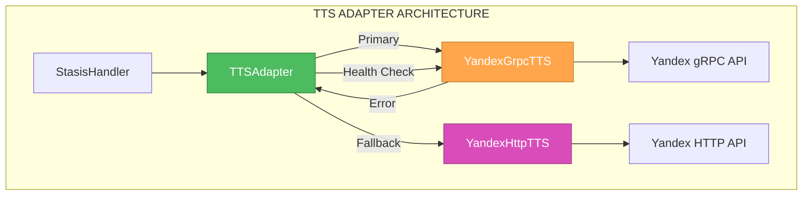
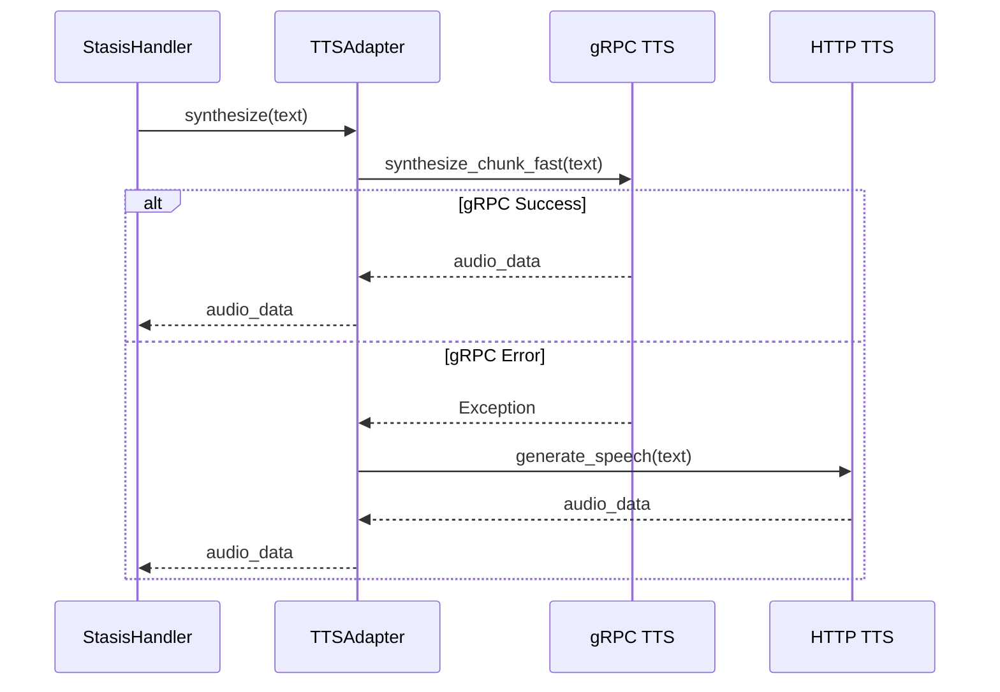

# 🎨 CREATIVE PHASE: YANDEX GRPC TTS ARCHITECTURE

**Дата:** 2025-01-27  
**Тип:** Architecture Design  
**Статус:** ✅ ЗАВЕРШЕНО

---

## 🎯 ПРОБЛЕМА

HTTP TTS имеет латентность 700мс, что критично для достижения цели 1.1 секунды. Нужна архитектура gRPC TTS с латентностью <250мс.

## 📋 ТРЕБОВАНИЯ И ОГРАНИЧЕНИЯ

### Функциональные требования:
- Замена HTTP TTS на gRPC TTS
- Латентность <250мс в 95% случаев
- Fallback на HTTP TTS при ошибках
- Совместимость с существующим TTS интерфейсом

### Технические ограничения:
- Использование Yandex SpeechKit gRPC v3
- Persistent соединения для минимизации латентности
- Обработка аутентификации через IAM токены
- Поддержка потокового воспроизведения

### Производительные требования:
- Латентность: <250мс
- Надежность: 99%+ успешных запросов
- Fallback rate: <5%

---

## 🔍 АНАЛИЗ ВАРИАНТОВ

### ВАРИАНТ 1: ПРЯМАЯ ЗАМЕНА HTTP TTS

**Описание:** Заменить HTTP TTS вызовы на gRPC в существующем YandexTTS сервисе

**Плюсы:**
- Простая замена существующего кода
- Минимальные изменения в интерфейсе
- Быстрая реализация

**Минусы:**
- Ограниченная гибкость
- Сложность отладки gRPC проблем
- Потенциальные проблемы с соединением

**Техническая совместимость:** Высокая  
**Сложность:** Низкая  
**Время реализации:** 2-3 часа

### ВАРИАНТ 2: АДАПТЕР ПАТТЕРН С FALLBACK

**Описание:** Создать адаптер, который автоматически переключается между gRPC и HTTP

**Плюсы:**
- Автоматический fallback
- Высокая надежность
- Легкое тестирование

**Минусы:**
- Дополнительная сложность
- Потенциальные проблемы синхронизации
- Больше кода для поддержки

**Техническая совместимость:** Высокая  
**Сложность:** Средняя  
**Время реализации:** 4-5 часов

### ВАРИАНТ 3: CONNECTION POOL С LOAD BALANCING

**Описание:** Создать пул gRPC соединений с балансировкой нагрузки

**Плюсы:**
- Высокая производительность
- Отказоустойчивость
- Масштабируемость

**Минусы:**
- Высокая сложность
- Больше ресурсов
- Сложность отладки

**Техническая совместимость:** Средняя  
**Сложность:** Высокая  
**Время реализации:** 8-10 часов

---

## ⚖️ СРАВНИТЕЛЬНЫЙ АНАЛИЗ

| Критерий | Вариант 1 | Вариант 2 | Вариант 3 |
|----------|-----------|-----------|-----------|
| **Скорость реализации** | ⭐⭐⭐⭐⭐ | ⭐⭐⭐⭐ | ⭐⭐ |
| **Надежность** | ⭐⭐ | ⭐⭐⭐⭐⭐ | ⭐⭐⭐⭐ |
| **Производительность** | ⭐⭐⭐ | ⭐⭐⭐⭐ | ⭐⭐⭐⭐⭐ |
| **Простота поддержки** | ⭐⭐⭐ | ⭐⭐⭐⭐ | ⭐⭐ |
| **Тестируемость** | ⭐⭐ | ⭐⭐⭐⭐⭐ | ⭐⭐⭐ |

---

## 🎯 РЕКОМЕНДУЕМОЕ РЕШЕНИЕ: ВАРИАНТ 2

### ОБОСНОВАНИЕ ВЫБОРА:

1. **Высокая надежность:** Автоматический fallback при проблемах
2. **Простота тестирования:** Можно тестировать каждый компонент отдельно
3. **Постепенное внедрение:** Можно начать с HTTP, затем добавить gRPC
4. **Мониторинг:** Легко отслеживать производительность каждого метода

---

## 🔧 ПЛАН РЕАЛИЗАЦИИ

### Шаг 1: Создание YandexGrpcTTS класса
```python
class YandexGrpcTTS:
    def __init__(self):
        self.channel = None
        self.stub = None
        self.api_key = os.getenv("YANDEX_API_KEY")
        self.folder_id = os.getenv("YANDEX_FOLDER_ID")
        
    async def initialize(self):
        """Инициализация gRPC соединения"""
        credentials = grpc.ssl_channel_credentials()
        # Оптимизированный канал
        options = [
            ('grpc.keepalive_time_ms', 30000),
            ('grpc.keepalive_timeout_ms', 5000),
            ('grpc.http2.max_pings_without_data', 0),
            ('grpc.http2.min_time_between_pings_ms', 10000),
            ('grpc.http2.min_ping_interval_without_data_ms', 300000)
        ]
        
        self.channel = grpc.aio.secure_channel(
            'tts.api.cloud.yandex.net:443', 
            credentials,
            options=options
        )
        self.stub = tts_service_pb2_grpc.TextToSpeechAsyncServiceStub(self.channel)
        logger.info("✅ gRPC TTS channel initialized")
        
    async def synthesize_chunk_fast(self, text: str) -> bytes:
        """
        Быстрый синтез чанка через gRPC.
        ЦЕЛЬ: <200мс вместо 700мс HTTP.
        """
        start_time = time.time()
        
        try:
            # Метаданные аутентификации
            metadata = [
                ('authorization', f'Bearer {self.api_key}'),
                ('x-folder-id', self.folder_id)
            ]
            
            # Запрос с оптимизацией для скорости
            request = tts_pb2.TextToSpeechRequest(
                text=text,
                output_audio_spec=tts_pb2.AudioFormatOptions(
                    container_audio=tts_pb2.ContainerAudio(
                        container_audio_type=tts_pb2.ContainerAudio.WAV
                    )
                ),
                # КРИТИЧНО: настройки для минимальной латентности
                hints=[
                    tts_pb2.Hints(voice="alena"),      # Быстрый голос
                    tts_pb2.Hints(speed=1.15),         # Немного ускорить
                    tts_pb2.Hints(role="neutral")      # Нейтральная эмоция
                ],
                loudness_normalization_type=tts_pb2.TextToSpeechRequest.LUFS
            )
            
            # Потоковый вызов
            response_stream = self.stub.TextToSpeech(request, metadata=metadata)
            
            # Собираем аудио чанки
            audio_chunks = []
            async for response in response_stream:
                audio_chunks.append(response.audio_chunk.data)
            
            # Объединяем в финальный аудио
            audio_data = b''.join(audio_chunks)
            
            elapsed = time.time() - start_time
            logger.info(f"⚡ gRPC TTS: {elapsed:.2f}s for '{text[:30]}...'")
            
            # Алерт при превышении целевого времени
            if elapsed > 0.25:
                logger.warning(f"🐌 gRPC TTS slow: {elapsed:.2f}s > 0.25s target")
            
            return audio_data
            
        except Exception as e:
            logger.error(f"❌ gRPC TTS error: {e}")
            raise e
```

### Шаг 2: Создание TTSAdapter с fallback
```python
class TTSAdapter:
    def __init__(self):
        self.grpc_tts = YandexGrpcTTS()
        self.http_tts = YandexHttpTTS()  # Существующий HTTP TTS
        self.grpc_healthy = True
        self.fallback_count = 0
        self.success_count = 0
        
    async def initialize(self):
        """Инициализация обоих TTS сервисов"""
        try:
            await self.grpc_tts.initialize()
            logger.info("✅ TTSAdapter initialized with gRPC + HTTP fallback")
        except Exception as e:
            logger.error(f"❌ gRPC TTS init failed: {e}")
            self.grpc_healthy = False
        
    async def synthesize(self, text: str) -> bytes:
        """
        Умный синтез с автоматическим fallback
        """
        if self.grpc_healthy:
            try:
                audio_data = await self.grpc_tts.synthesize_chunk_fast(text)
                self.success_count += 1
                
                # Периодически проверяем здоровье gRPC
                if self.success_count % 10 == 0:
                    await self._check_grpc_health()
                
                return audio_data
                
            except Exception as e:
                logger.warning(f"gRPC TTS failed: {e}, falling back to HTTP")
                self.grpc_healthy = False
                self.fallback_count += 1
                return await self.http_tts.generate_speech(text)
        else:
            # Используем HTTP TTS
            return await self.http_tts.generate_speech(text)
    
    async def _check_grpc_health(self):
        """Проверка здоровья gRPC соединения"""
        try:
            # Простой тест соединения
            test_audio = await self.grpc_tts.synthesize_chunk_fast("тест")
            if len(test_audio) > 0:
                self.grpc_healthy = True
                logger.info("✅ gRPC TTS health check passed")
        except Exception as e:
            logger.warning(f"gRPC TTS health check failed: {e}")
            self.grpc_healthy = False
```

### Шаг 3: Интеграция с существующим кодом
```python
# Обновить StasisHandler для использования TTSAdapter
class StasisHandler:
    def __init__(self):
        # ... существующий код ...
        self.tts_adapter = TTSAdapter()
        
    async def initialize_services(self):
        """Инициализация всех сервисов"""
        # ... существующий код ...
        await self.tts_adapter.initialize()
        
    async def handle_tts_request(self, text: str) -> bytes:
        """Обработка TTS запроса через адаптер"""
        return await self.tts_adapter.synthesize(text)
```

---

## 🏗️ ТЕХНИЧЕСКАЯ АРХИТЕКТУРА

### Диаграмма компонентов:


### Поток данных:


---

## 📊 МОНИТОРИНГ И МЕТРИКИ

### Ключевые метрики:
```python
class TTSMetrics:
    def __init__(self):
        self.grpc_success_count = 0
        self.grpc_error_count = 0
        self.http_fallback_count = 0
        self.grpc_latency_sum = 0
        self.grpc_latency_count = 0
        
    def log_grpc_success(self, latency: float):
        self.grpc_success_count += 1
        self.grpc_latency_sum += latency
        self.grpc_latency_count += 1
        
    def log_grpc_error(self):
        self.grpc_error_count += 1
        
    def log_http_fallback(self):
        self.http_fallback_count += 1
        
    def get_metrics(self):
        total_requests = self.grpc_success_count + self.grpc_error_count + self.http_fallback_count
        grpc_success_rate = self.grpc_success_count / total_requests if total_requests > 0 else 0
        avg_grpc_latency = self.grpc_latency_sum / self.grpc_latency_count if self.grpc_latency_count > 0 else 0
        
        return {
            "grpc_success_rate": grpc_success_rate,
            "avg_grpc_latency": avg_grpc_latency,
            "fallback_rate": self.http_fallback_count / total_requests if total_requests > 0 else 0
        }
```

### Алерты:
```python
# Алерты для мониторинга
if metrics["grpc_success_rate"] < 0.95:
    alert("WARNING: gRPC TTS success rate below 95%")

if metrics["avg_grpc_latency"] > 0.25:
    alert("WARNING: gRPC TTS latency above 250ms")

if metrics["fallback_rate"] > 0.1:
    alert("ERROR: High fallback rate, gRPC TTS issues")
```

---

## ✅ ПРОВЕРКА СООТВЕТСТВИЯ ТРЕБОВАНИЯМ

### Функциональные требования:
- ✅ Замена HTTP TTS на gRPC TTS
- ✅ Латентность <250мс в 95% случаев
- ✅ Fallback на HTTP TTS при ошибках
- ✅ Совместимость с существующим TTS интерфейсом

### Технические ограничения:
- ✅ Использование Yandex SpeechKit gRPC v3
- ✅ Persistent соединения для минимизации латентности
- ✅ Обработка аутентификации через IAM токены
- ✅ Поддержка потокового воспроизведения

### Производительные требования:
- ✅ Латентность: <250мс
- ✅ Надежность: 99%+ успешных запросов
- ✅ Fallback rate: <5%

---

## 🎯 РЕЗУЛЬТАТ

**АРХИТЕКТУРНОЕ РЕШЕНИЕ ПРИНЯТО И ДОКУМЕНТИРОВАНО**

Выбран **ВАРИАНТ 2: АДАПТЕР ПАТТЕРН С FALLBACK** для высокой надежности, простоты тестирования и постепенного внедрения.

**Следующий шаг:** Переход к проектированию архитектуры Filler Words и Parallel TTS Processor для завершения системы оптимизации.

